# WIFI-On-Boarding
## Overview
WIFI-On-Boarding mainly includes scanning the surrounding hotspots in STA mode, creating a new WIFI connection, and obtaining the ssid and psk of the currently connected WIFI. After switching the SAP mode, you can create a new hotspot and get the ssid and psk of the current hotspot.
## 1. Init :
### (1) get code
```
$ adb shell
$ cd /home
$ git clone https://github.com/quic/sample-apps-for-Qualcomm-Robotics-RB5-platform.git
$ cd /home/WIFI-On-Boarding/wifi
```
### (2) get tools
If you want to use the hotspot function(AP Mode), you need to download the iptables tool to forward the data from the physical network port.
```
$ apt-get install iptables
```
Then you can use AP mode to access the network.Of course, if you don't need to access the network, you don't need to download this tool. AP mode just creates a hotspot that can't access the network.

## 2. Compile :
```
$ gcc wifi.c -o wifi
```
## 3. Run :
```
$ ./wifi
```
Enter the corresponding operation number according to the menu reminder.

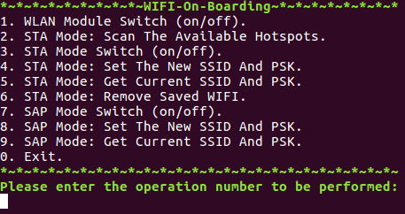

## 4. Result :
### (1) WiFi module switch (on/off).-->wifi_switch.sh
User input: 1

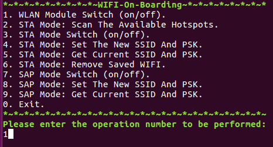

If you choose 'on'/'off', you can see something similar to the following.

User input: on

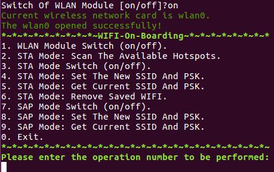

User input: off


Check: you can check the status of wlan0 through commands "$ ifconfig".

Note: of course, you must turn on wlan0 for the following operations.

### (2) STA mode:scan the available hotspot and return signal strength.-->wifi.c
User input: 2

Check: if successful, you can see the same situation as the picture below.

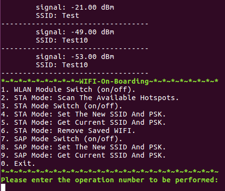

### (3) STA mode switch (on/off).-->sta_switch.sh
User input: 3

User input: on

User input: "network id"

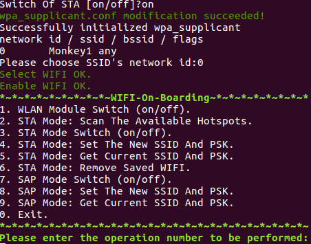

Check:If successful, the board can be connected to the WiFi of your choice

User input: off

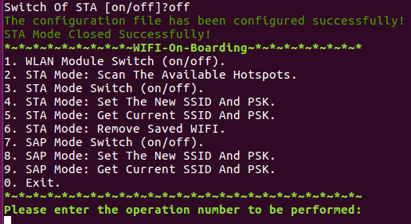

Check:The board will disconnect WiFi

Note:You can also use this function to select a saved WiFi

### (4) STA mode:set the new SSID and PSK.-->set_sta.sh
User input: 4

User input: "New SSID"

User input: "New PSK"

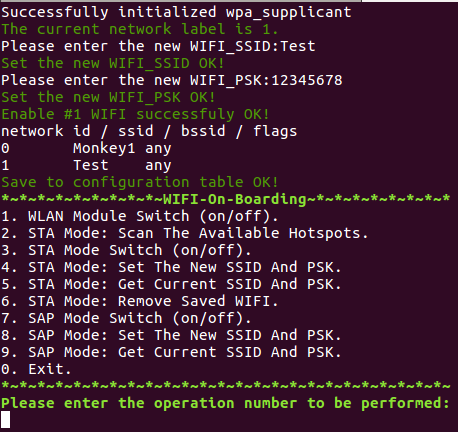

Check: if successful, the board will switch to the new WiFi.

If you create the same SSID and PSK, you will be rejected.

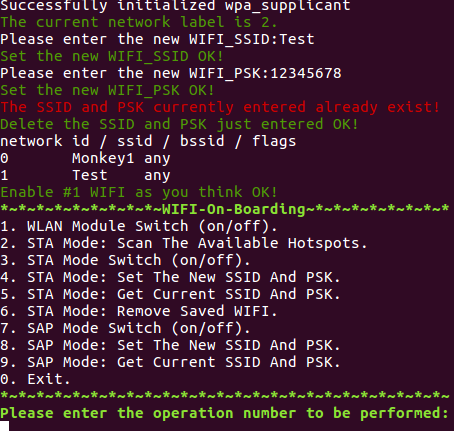

Check: it connects to the saved WFI.

### (5) STA mode:get current SSID and PSK.-->get_sta.sh
User input: 5

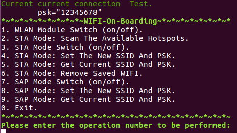

If you're not connected to WiFi to get it.

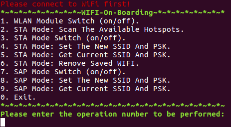

### (6) STA Mode: Remove Saved WIFI.-->rm_sta.sh
User input: 6

User input: "network id"

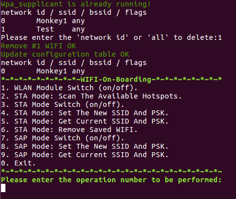

Or user input: all

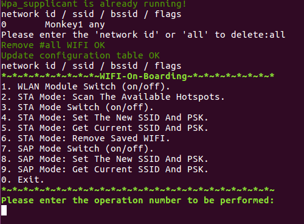

### (7) SAP mode switch (on/off).-->ap_switch.sh
User input: 7

User input: on


Check: when a device is connected, you can see the following log.Of course, you can use your phone to connect to this hotspot.


User input: off

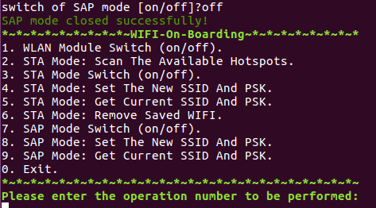

Check: other devices disconnect the hot spots from the board

### (8) SAP mode:set the new SSID and PSK.-->set_ap.sh
User input: 8

User input: "new Hostpot_SSID"

User input: "new Hostpot_PSK"

User input: on


Check: if successful, you can see the same display as function 6.


### (9) SAP mode:get current SSID and PSK.-->wifi.c
User input: 9

If successful, you can see the current hotspot SSID and PSK

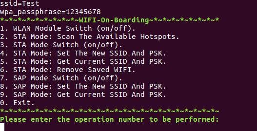

## 5. matters needing attention
1. When using the AP function, you need to download the iptables tool first.

2. When using the AP function, some logs will be printed, but it does not hinder the use of other functions. You can continue to enter the operation number.

3. Set new SSID cannot be empty. The length of PSK must be greater than 8.

4. I wish you a good time :)

## License
This is licensed under the BSD 3-Clause-Clear “New” or “Revised” License. Check out the [LICENSE](LICENSE) for more details.
